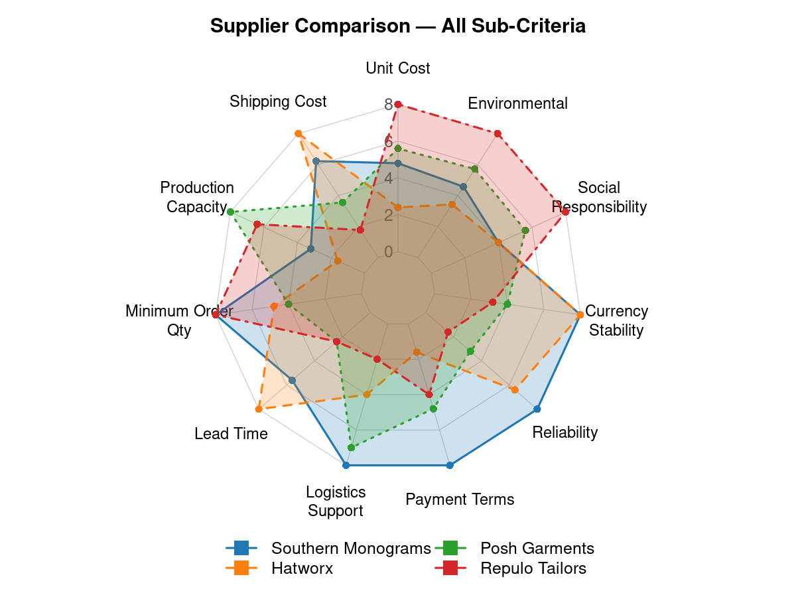
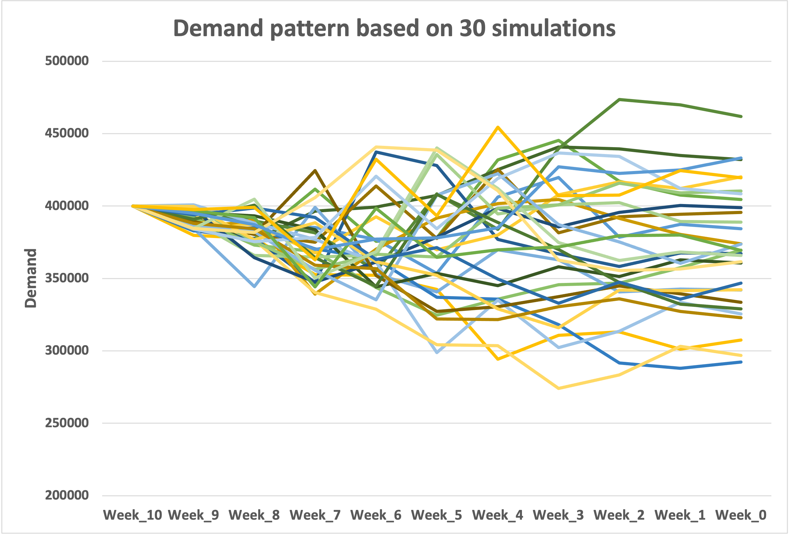
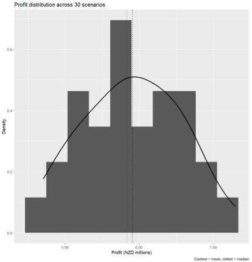

# Supply Chain Strategy Under Demand Uncertainty

## Overview

This project explores how to design a supply chain strategy for a high-demand event under uncertainty.

The analysis integrates supplier selection, ordering strategy, demand simulation, profitability assessment, sustainability considerations, and risk evaluation to support a robust sourcing and fulfilment plan.

## Problem Context

A retailer must supply approximately 400,000 units for a one-time event within a 10-week planning horizon. Demand is highly uncertain early on but becomes more predictable as the event approaches.

Key decisions include:
- which suppliers to use (local vs international)
- how to balance cost, capacity, and delivery risk
- how much to order at each stage under uncertain demand

## Approach

- Applied Analytic Hierarchy Process (AHP) for multi-criteria supplier evaluation  
- Designed a staged ordering strategy to adapt to demand uncertainty  
- Simulated demand across 30 scenarios to test strategy performance  
- Evaluated profitability and cost–performance trade-offs  
- Assessed sustainability considerations and supply chain risks  

## Supplier Strategy

Supplier selection was based on multiple criteria, including cost, capacity, delivery, and sustainability.

The analysis shows that no single supplier dominates across all criteria.  
A multi-sourcing strategy was therefore used to balance cost efficiency, capacity, and operational risk.

## Ordering Strategy

A staged ordering approach was used to manage uncertainty and supplier risk:

- **Repulo Tailors (Ukraine)** – primary offshore supplier offering low unit cost and high production capacity  
- **Posh Garments (Bangladesh)** – secondary supplier providing flexible capacity for demand adjustments  
- **Local suppliers (New Zealand)** – used for fast turnaround and last-mile demand fulfilment  

Orders were placed progressively as demand uncertainty reduced, improving responsiveness while limiting overstock risk.

## Demand Uncertainty

Demand was simulated across 30 scenarios to reflect uncertainty over the planning horizon.

Demand variability decreases as the event approaches, supporting a staged ordering approach rather than committing full volume upfront.

## Profit Assessment

The strategy was evaluated across multiple demand scenarios.

Results show consistent profitability across all scenarios, indicating strong financial resilience despite demand uncertainty.

## Risk & Sustainability

The strategy balances cost efficiency with supply chain resilience and sustainability:

- Multi-sourcing reduces dependency on a single supplier  
- Local sourcing supports faster response and lower transport impact  
- International sourcing improves cost and capacity but introduces logistics and geopolitical risks  

These trade-offs were considered in the final sourcing decision.

## Key Insights

- Supplier selection should balance capacity, cost, and delivery reliability rather than optimise a single factor  
- A staged ordering strategy performs better than committing full volume upfront under uncertainty  
- Profitability remains stable across different demand scenarios, demonstrating strong strategy robustness  
- Combining global and local suppliers improves both flexibility and risk management  

## My Contribution

This project was completed as part of a group case study. My contribution focused on:

- supplier evaluation and comparison  
- scenario simulation and analysis  
- development of ordering strategy and cost–profit assessment  
- data visualisation and presentation design  

 
## Academic Use Notice

This project was completed as part of a group assignment at the University of Auckland and is shared for educational and portfolio purposes only.
The work presented reflects collaborative academic effort. Unauthorised use, reproduction, or redistribution may violate academic integrity policies.
